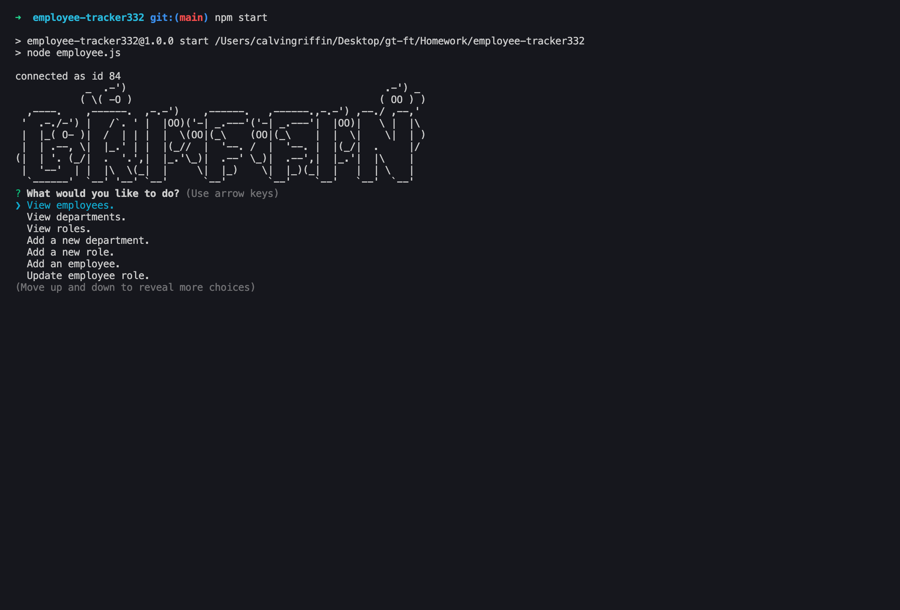
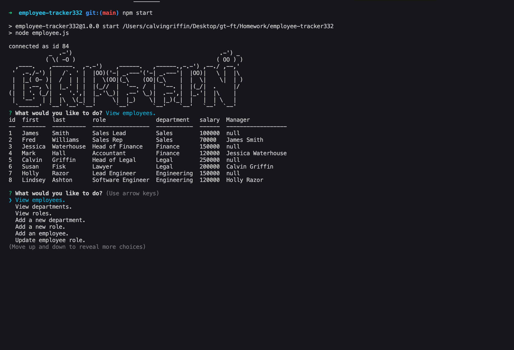
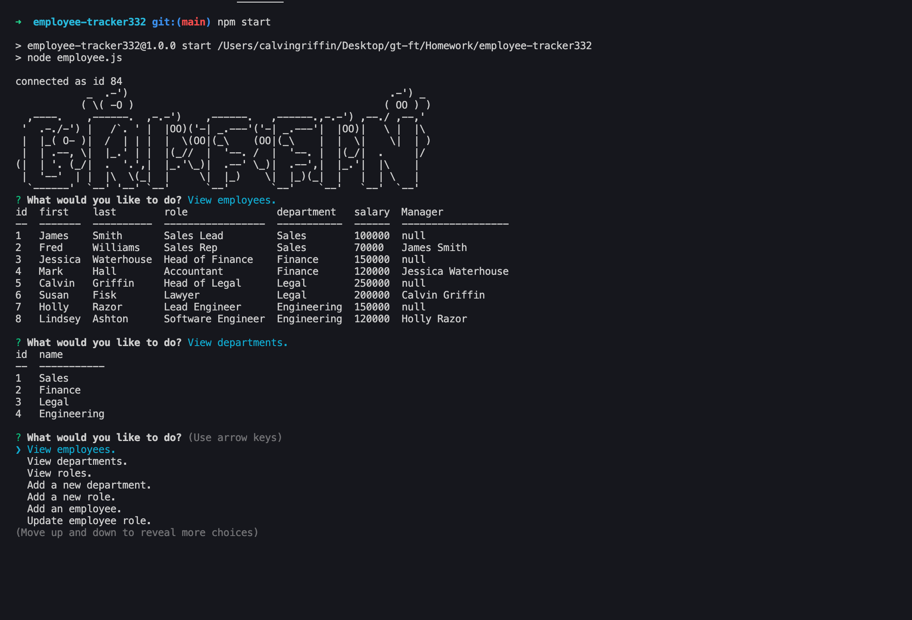
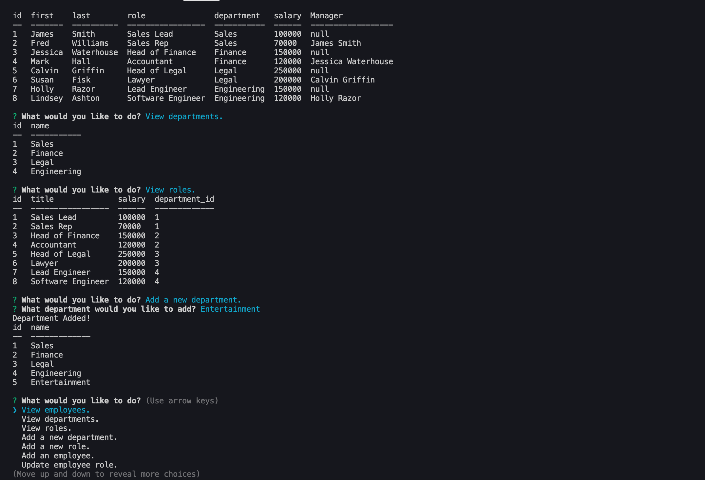
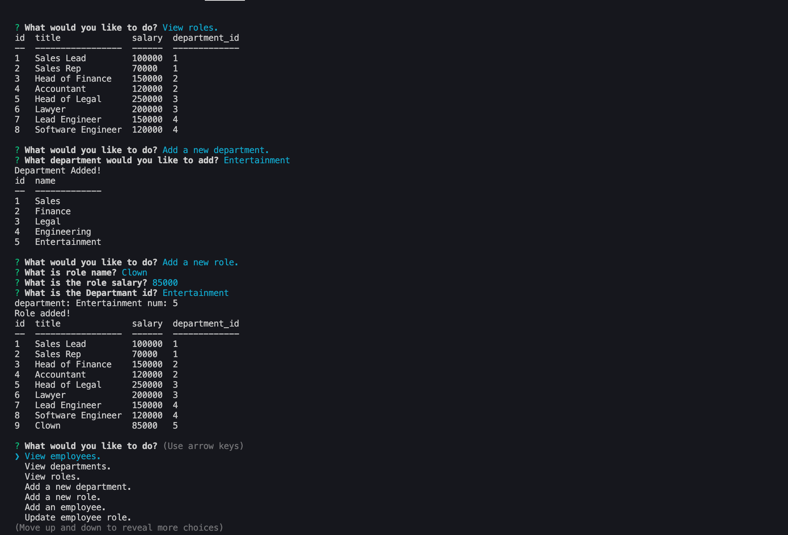
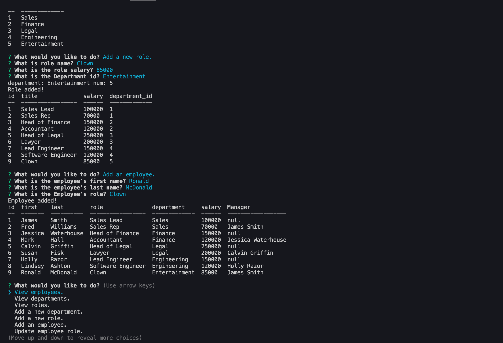
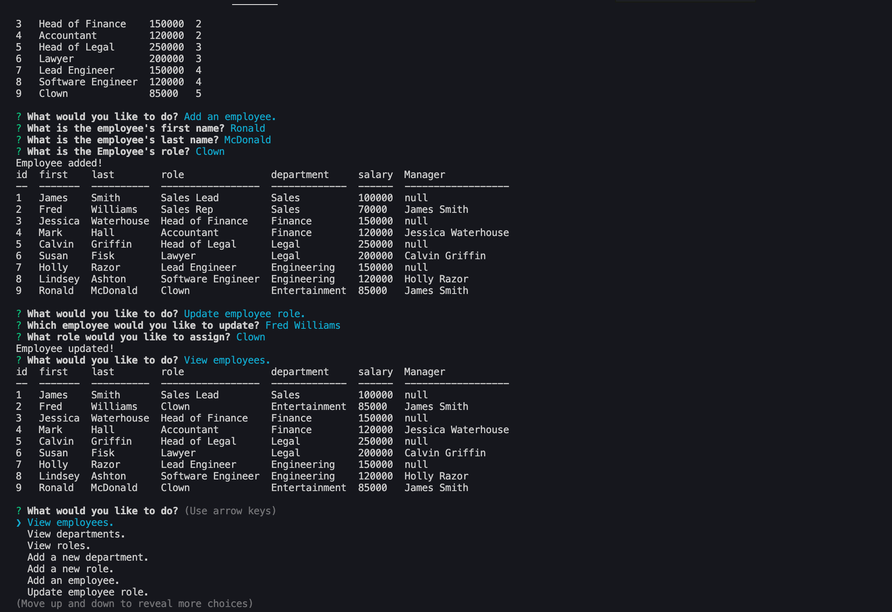
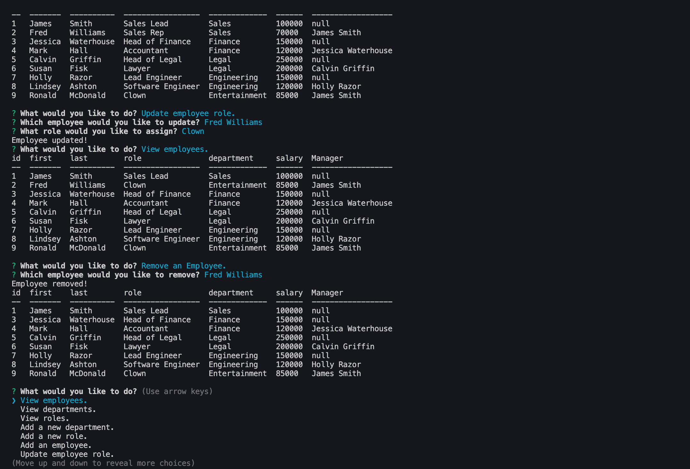
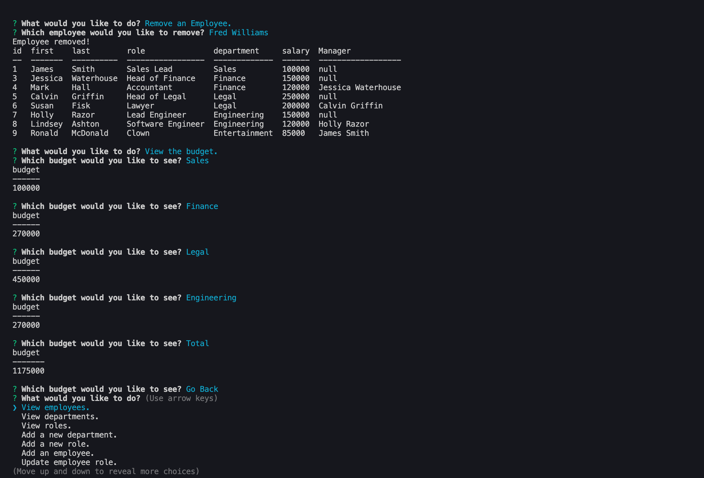
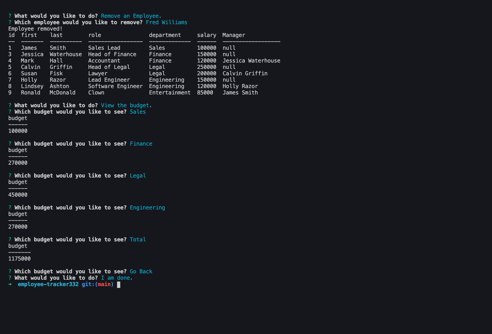

# Employee-Tracker332

## Description

This project is a command line application that allows the user to keep track of, and edit employee information, job departments, and job roles using mysql and inquirer.  It is geared towards business owners so that they are able to view and manage the departments, roles, and employees in their company in order to organize and plan their business.

## Table of Contents

* [Installation](#installation)
* [Usage](#usage)
* [License](#license)
* [Contributing](#Contributing)
* [Tests](#tests)
* [Questions](#questions)

## Installation

First, copy the files from this GitHub repo, including employee.js, employeeSeed.sql, and package, json files. Then, run “npm i” to install all dependencies.  Open up mysql Workbench and get it running, and make sure to insert your password into the employee.js file.  Next, you will take the employeeSeed.sql, copy it into Workbench, and run it to create the table on your local connection. Once all of this is complete, simply run the command “npm start” in your terminal.

## Usage

Once the start command is run, the user will be shown a list asking what they want to do. 

They can “View employees.”, which shows a list of all employees and information, 

“View departments.” which shows all departments, 

“View roles.” which shows all roles, 

“Add a new department.” which leads to questions which allows the user to add a department,  

“Add a new role.” which leads to questions which allows the user to add a role, 

“Add a new employee.” which leads to questions which allows the user to add an employee, 

“Update employee role.” which allows the user to update an employee’s role, 

“Remove an employee.”, or 

“View the budget.” by department or total.  

Once the user is finished, choose “I am done.”.

## License

This project is covered under the MIT License.  
Copyright (c) [2020] [Calvin Griffin]  
Permission is hereby granted, free of charge, to any person obtaining a copy of this software and associated documentation files (the "Software"), to deal in the Software without restriction, including without limitation the rights to use, copy, modify, merge, publish, distribute, sublicense, and/or sell copies of the Software, and to permit persons to whom the Software is furnished to do so, subject to the following conditions:
The above copyright notice and this permission notice shall be included in all copies or substantial portions of the Software.
THE SOFTWARE IS PROVIDED "AS IS", WITHOUT WARRANTY OF ANY KIND, EXPRESS OR IMPLIED, INCLUDING BUT NOT LIMITED TO THE WARRANTIES OF MERCHANTABILITY, FITNESS FOR A PARTICULAR PURPOSE AND NONINFRINGEMENT. IN NO EVENT SHALL THE AUTHORS OR COPYRIGHT HOLDERS BE LIABLE FOR ANY CLAIM, DAMAGES OR OTHER LIABILITY, WHETHER IN AN ACTION OF CONTRACT, TORT OR OTHERWISE, ARISING FROM, OUT OF OR IN CONNECTION WITH THE SOFTWARE OR THE USE OR OTHER DEALINGS IN THE SOFTWARE.

## Contributing

If you would like to contribute, please contact me via GitHub or email.

## Tests

Give it a spin and test it yourself.

## Questions

If you have any additional questions, please contact me via email or GitHub by clicking the links below.

Email: cgriffin332@gmail.com  
GitHub: https://github.com/cgriffin332
